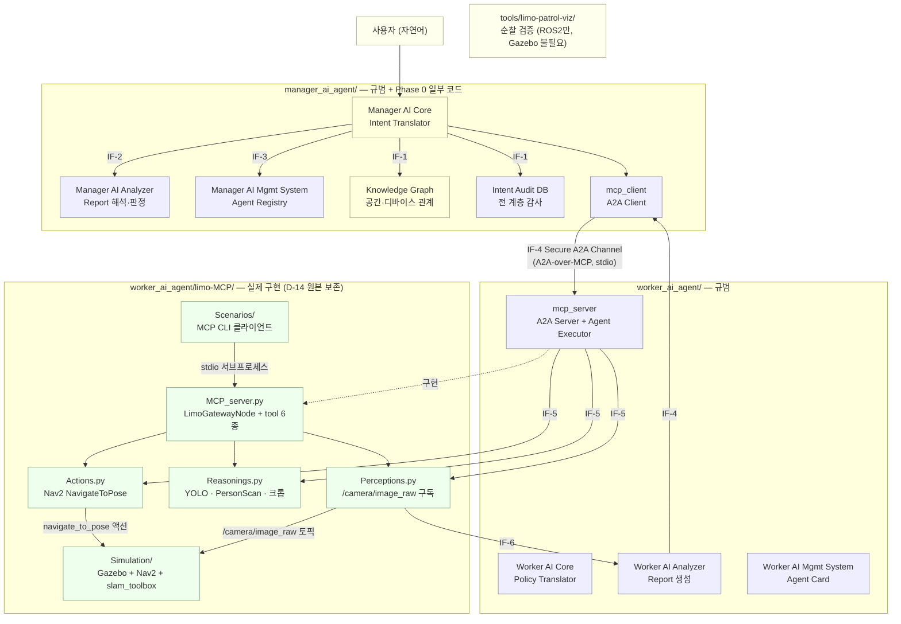

# 아키텍처

> 설계 정본: `docs/spec/AI-Care_Unified_Architecture_Spec_v0.2.md` · 구조 정본: `SOT.md`
> 이 문서는 **코드에서 확인된 것**과 **규범상 정의된 것**을 구분해 적는다.

## 전체 구조



**파랑 = 규범만(코드 없음) · 연노랑 = 부분 구현 · 초록 = 실제 동작하는 코드 · 노랑 = 외부·도구**

## 컴포넌트 한 줄 설명

### Manager AI Agent — Phase 0 일부 구현

| 컴포넌트 | 역할 |
|---|---|
| `manager_ai_core/` | 축 라우팅+결정론 규칙 평가 지원 코어와 시나리오 2 규칙 정책. 자연어→L1→범용 L2 전체는 미구현 |
| `manager_ai_analyzer/` | Worker Report를 해석해 완료·재시도·Worker 전환·에스컬레이션 판정 |
| `manager_ai_management_system/` | Worker 등록·상태·수명주기 + Agent Registry + Worker 선택 |
| `knowledge_graph/` | 사용자·공간·디바이스의 관계와 능력 (누가 무엇을 할 수 있는가) |
| `intent_audit_database/` | intent·policy 이력, 스키마 프롬프트, 검증 규칙. P-5 감사 실현처 |
| `mcp_client/` | IF-4의 Manager 측 종단점 |

### Worker AI Agent

| 컴포넌트 | 역할 | 구현 |
|---|---|---|
| `worker_ai_core/` | L2 → L3(디바이스 특화) 정책 번역 + 세션 키 검증 | 없음 |
| `worker_ai_analyzer/` | SF 실행 상태 수집 → Worker Report 생성 | 없음 |
| `worker_ai_management_system/` | 자기 등록 + Agent Card 공개 | 없음 |
| `perception/` | 디바이스 데이터 획득 | `limo-MCP/Worker_functions/Perceptions.py` |
| `reasoning/` | 관측으로부터 상태 판단 | `limo-MCP/Worker_functions/Reasonings.py` |
| `action/` | 물리 행동 (Nav2 주행) | `limo-MCP/Worker_functions/Actions.py` |
| `mcp_server/` | IF-4 Worker 측 종단점 + Agent Executor | `limo-MCP/MCP_server/MCP_server.py` |

### 비컴포넌트

| 경로 | 역할 |
|---|---|
| `worker_ai_agent/limo-MCP/Simulation/` | Gazebo + Nav2 + slam_toolbox 브링업 (turtlebot3 waffle, AWS small_house) |
| `worker_ai_agent/limo-MCP/Scenarios/` | MCP 왕복 CLI 클라이언트 |
| `tools/limo-patrol-viz/` | Gazebo·Nav2·YOLO 없이 순찰 로직 검증 |
| `interfaces/` | IF-1~IF-8 인터페이스 카탈로그 (표준화 산출물 S-6) |
| `contracts/` | L1~L3 · Report 페이로드 스키마 자리 (미작성) |

## 실제 데이터 흐름 (코드로 확인된 것)

```
Scenarios/send_goal.py
  └─ stdio 서브프로세스로 MCP_server.py 기동
       └─ rclpy.init() → LimoGatewayNode 생성 → rclpy.spin() 데몬 스레드
            ├─ PerceptionModule  : /camera/image_raw 구독 (최신 1프레임 캐시)
            ├─ ReasoningModule   : detect_fn=yolo_detect, crop_fn, frame_source 주입
            └─ ActionModule      : navigate_to_pose 액션 클라이언트
       └─ mcp.run(transport="stdio")
  └─ session.call_tool("plan_and_navigate", {...})
       └─ _plan_fn(검증만) → send_goal_sequence → NavigateToPose → Nav2
  └─ session.call_tool("get_status") 폴링
```

## 계층 구조 (Intent-Policy Continuum)

| 계층 | 내용 | 위치 |
|---|---|---|
| L0 | 자연어 의도 | 사용자 |
| L1 | Intent Query (JSON) | `contracts/intent_query/` — 미작성 |
| L2 | High-level Policy (ECA XML, device-agnostic) | `contracts/high_level_policy/` — 미작성 |
| L3 | Low-level Policy (디바이스 특화) | `contracts/low_level_policy/` — 미작성 |
| L4 | 함수 호출 (MCP tool / ROS2 액션) | **구현됨** — `MCP_server.py` tool 6종 |

**L4 실행 경로와 고립된 Manager Phase 0 지원 모듈만 존재한다.** L0→L1→L2→L3 종단 연결은 미구현이다.

## 인터페이스 카탈로그

| ID | 이름 | 종단점 | Phase | 구현 |
|---|---|---|---|---|
| IF-1 | Database Interface | MAC ↔ KG/IAD, MAA ↔ IAD | 0 | 없음 |
| IF-2 | Analytics Interface | MAC ↔ MAA, WAC ↔ WAA | 0 | 없음 |
| IF-3 | Registration Interface | MAC ↔ MAMS, WAC ↔ WAMS | 0 | 없음 |
| IF-4 | **Secure A2A Channel** | MAC ↔ WAC | 0 | **부분** — MCP stdio 서버는 동작, A2A 의미론 미구현 |
| IF-5 | SF-Facing Interface | WAC → PF/RF/AF | 0 | 코드 경계로만 존재 (`LimoGatewayNode` 직접 주입) |
| IF-6 | Agent Monitoring Interface | PF/RF/AF → WAA | 0 | 없음 |
| IF-7 | AMS-Facing Interface | MAMS ↔ WAMS | 2 | 없음 |
| IF-8 | Analyzer-Facing Interface | MAA ↔ WAA | 2 | 없음 |
